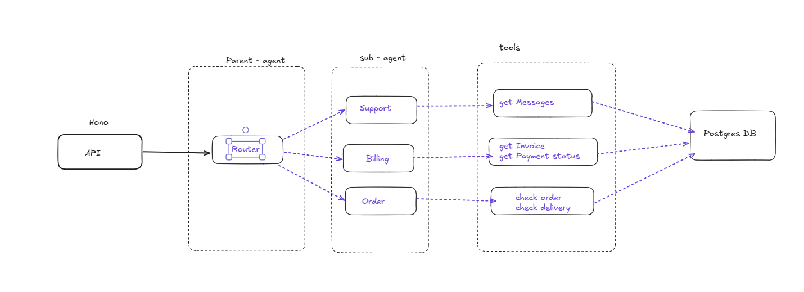

# Swades AI — Multi-Agent Customer Support

An AI-powered customer support system built with a multi-agent architecture. A supervisor agent classifies incoming messages and routes them to specialized sub-agents that query real database records to respond accurately.

## Architecture



## Apps

| App | Description |
|-----|-------------|
| `web` | Next.js 16 chat UI with conversation sidebar and real-time typing indicator |
| `backend` | Hono API server with multi-agent pipeline, rate limiting, and Drizzle ORM |

## Tech Stack

**Frontend**
- Next.js 16, React 19, Tailwind CSS v4
- Hono RPC client (`hc<AppType>`) for end-to-end type-safe API calls

**Backend**
- Hono v4 (Bun runtime)
- AI SDK v6 — `generateText`, `Output.object`, `stopWhen: stepCountIs`
- OpenAI `gpt-4o` (router), `gpt-4o-mini` (sub-agents)
- Drizzle ORM + PostgreSQL (Supabase)
- `hono-rate-limiter` — 60 req/min global, 10 req/min on `/chat/message`
- Workflow DevKit (`"use workflow"`) — durable agent execution

## Project Structure

```
swades.ai/
├── apps/
│   ├── web/                     # Next.js frontend
│   │   └── app/page.tsx         # Chat UI
│   └── backend/
│       └── src/
│           ├── index.ts         # Hono app entry, AppType export
│           ├── agents/
│           │   ├── router.ts    # Supervisor — classifies + routes
│           │   ├── order.ts     # Order sub-agent
│           │   ├── billing.ts   # Billing sub-agent
│           │   └── support.ts   # Support sub-agent
│           ├── db/
│           │   ├── schema.ts    # Drizzle schema
│           │   └── seed.ts      # Seed data (1 user, 5 orders, 5 payments)
│           ├── routes/
│           │   └── chat.ts      # POST /message, GET/DELETE /conversation
│           └── utils/
│               ├── tools.ts     # AI SDK tools (findOrder, findPayment, etc.)
│               └── context.ts   # getConversation — last 6 messages from DB
└── packages/
    ├── ui/                      # Shared React component library
    ├── eslint-config/
    └── typescript-config/
```

### Environment Variables

**`apps/backend/.env`**
```env
DATABASE_URL=your_postgres_connection_string
OPENAI_API_KEY=your_openai_api_key
```

**`apps/web/.env.local`**
```env
NEXT_PUBLIC_BACKEND_URL=http://localhost:3000
```

### Install & Run

```sh
# Install dependencies
bun install

# Push schema to database
cd apps/backend && bun run db:push

# Seed the database
bun run db:seed

# Run all apps (from root)
turbo dev

# Or run individually
turbo dev --filter=web      # http://localhost:3001
turbo dev --filter=backend  # http://localhost:3000
```

### Build

```sh
turbo build
```

## API Endpoints

| Method | Path | Description |
|--------|------|-------------|
| `POST` | `/chat/message` | Send a message, get AI response |
| `GET` | `/chat/conversation` | List all conversations |
| `GET` | `/chat/conversation/:id` | Get conversation with messages |
| `DELETE` | `/chat/conversation/:id` | Delete a conversation |
| `GET` | `/health` | Health check |
